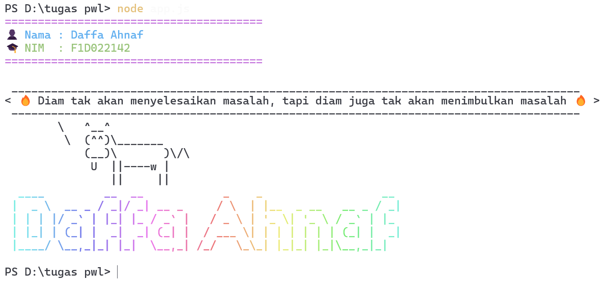

# week4-node-plugin
### langkah langkah instal depedensi
###### jalnkan salah satu perintah npm di terminal seperti berikut "npm install chalk cowsay figlet"
### langkah langkah menjalankan tugas
###### setelah paket terinstal dan program sudah disiapkan, jalankan perintah "node app.js" di terminal 
### hasil runn

